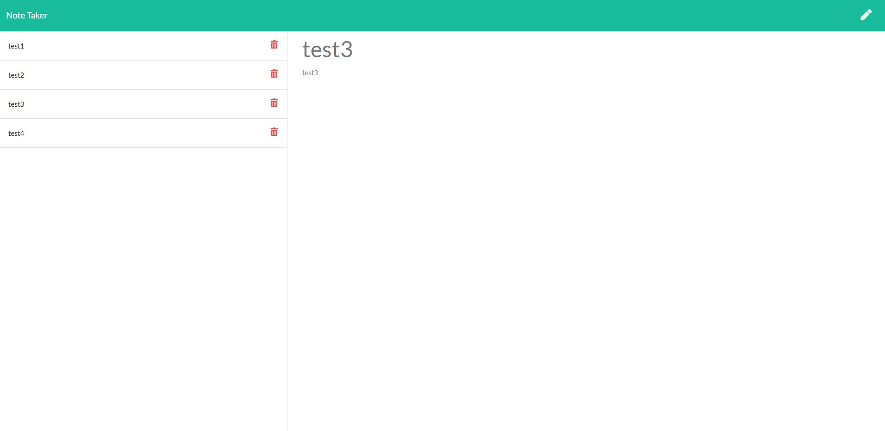
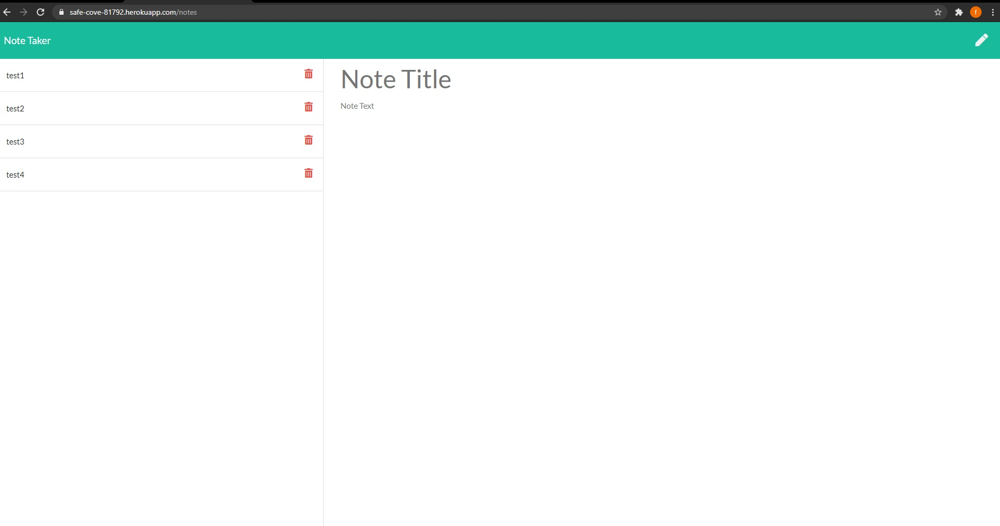

# note_taker

  
---
## Author
  
Shawn Fox
  
  
| [GitHub](https://github.com/sfoxgit) | [Email](sfoxgit@gmail.com) |
  
---
## Project Links:
  
- Deployed site: [Heroku](https://safe-cove-81792.herokuapp.com/notes)
  
- GitHub: [sfoxgit](https://github.com/SFoxGit/note_taker)
  
---
## Table of Contents
  
- [Description](##Description)
  
- [Installation](##Installation)
  
- [Usage](##Usage)
    
- [Questions](##Questions)
  
- [License](##License)
  
- [Contributions](##Contributing)
  
- [Credits](##Credits)
  
---
## Description

Modify starter code to create an application called Note Taker that can be used to write and save notes using Express. (Front end provided via starter code)

Saving and displaying notes correctly:

Able to add new note after save and siplay:

User Story:

  AS A small business owner
  I WANT to be able to write and save notes
  SO THAT I can organize my thoughts and keep track of tasks I need to complete

Acceptance Criteria:

  GIVEN a note-taking application
  WHEN I open the Note Taker
  THEN I am presented with a landing page with a link to a notes page
  WHEN I click on the link to the notes page
  THEN I am presented with a page with existing notes listed in the left-hand column, plus empty fields to enter a new note title and the note’s text in the right-hand column
  WHEN I enter a new note title and the note’s text
  THEN a Save icon appears in the navigation at the top of the page
  WHEN I click on the Save icon
  THEN the new note I have entered is saved and appears in the left-hand column with the other existing notes
  WHEN I click on an existing note in the list in the left-hand column
  THEN that note appears in the right-hand column
  WHEN I click on the Write icon in the navigation at the top of the page
  THEN I am presented with empty fields to enter a new note title and the note’s text in the right-hand column

---
## Installation

From GitHub:

In your terminal:  
git clone yourCloneCodeHere  
cd note_taker

If installing to Heroku:  
  In your teriminal IF already signed in to Heroku  

heroku create  
git push heroku main  
  
---
## Usage

Add notes to server, with the ability to display them and delete them.

  
---
## Questions
  
If you have any questions or concerns please contact me at sfoxgit@gmail.com or any of my contact information above. [Back to Author](##Author) 
  
--- 
 
## License 
 
https://opensource.org/licenses/MIT
  
---
## Contributing
  
If you'd like to contribute, please contact me.
  
---
## Credits
  
Trilogy Education Services, LLC for starter code (front end)
  

